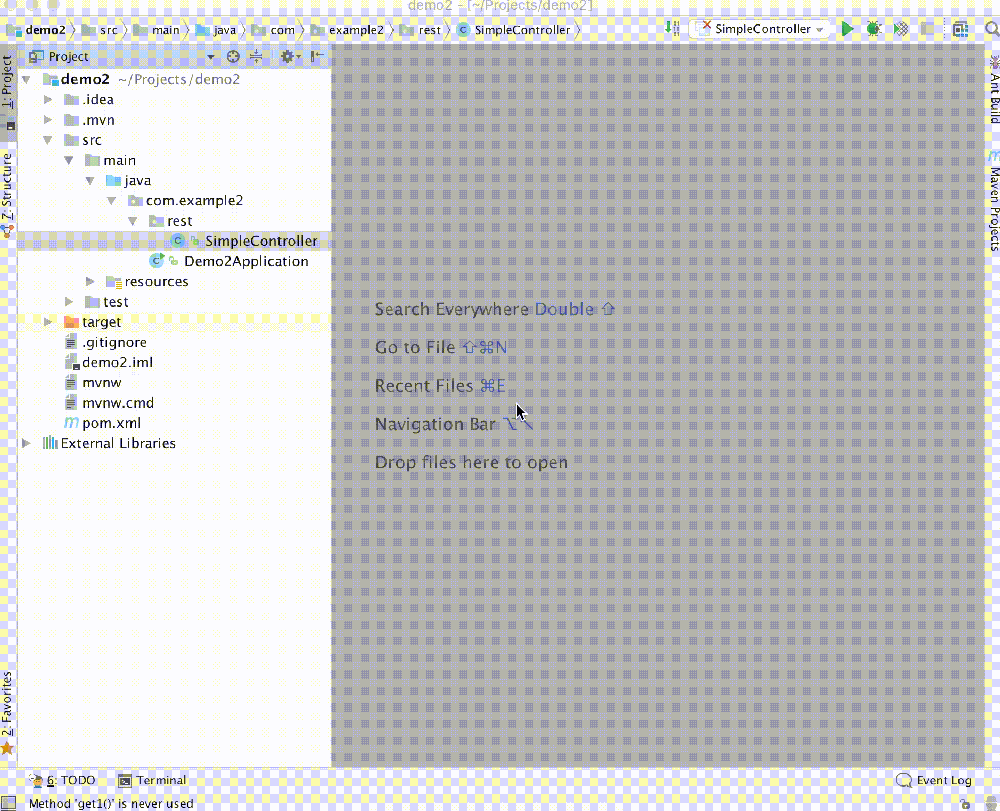

<div align="center">
    <a href="https://plugins.jetbrains.com/plugin/9567-request-mapper">
        
    </a>
</div>
<h1 align="center">Request Mapper</h1>
<p align="center">Request mapper is <a href="https://plugins.jetbrains.com/search?tags=Navigation">#2 plugin</a> for IntelliJ IDEA for quick navigation to URL mapping declarations with over 72 000 downloads.</p>

<p align="center">
<a href="https://github.com/viartemev/requestmapper/actions?query=workflow%3ACI"></a>
<a href="https://plugins.jetbrains.com/plugin/9567-request-mapper"></a>
<a href="https://plugins.jetbrains.com/plugin/9567-request-mapper"></a>
<a href="https://codecov.io/gh/viartemev/requestmapper"></a>
<a href="https://www.codetriage.com/viartemev/requestmapper"></a>
<a href="https://snyk.io/test/github/viartemev/requestmapper?targetFile=build.gradle"></a>
</p>

## Plugin info

#### Supported languages:

- Java
- Kotlin

#### Supported annotations:

| Spring  | JAX-RS  | Micronaut  |
|:-:|:-:|:-:|
| ```@RequestMapping``` | | |
| ```@GetMapping``` | ```@GET``` | ```@Get``` |
| ```@PostMapping```  | ```@POST``` | ```@Post``` |
| ```@PutMapping``` | ```@PUT``` | ```@Put``` |
| ```@DeleteMapping``` | ```@DELETE``` | ```@Delete``` |
| ```@PatchMapping``` | ```@PATCH``` |  ```@Patch``` |
| | ```@OPTIONS``` |  ```@Options``` |
| | ```@HEAD``` | ```@Head``` |

## Usage

- Search everywhere (```Shift``` twice)
- Keyboard shortcuts:
    - MacOS: ```Cmd + Shift + Back slash```
    - Linux: ```Ctrl + Shift + Back slash```
    - Windows: ```Ctrl + Shift + Back slash```
- Navigate (menu bar) -> Request mapping

## Contributors

Thanks to all people who have contributed to this plugin:
+ [Dmitry Chuiko](https://github.com/dchuiko)
+ [Paul Finkelshteyn](https://github.com/asm0dey)
+ [Pyltsin Mikhail](https://github.com/pyltsin)

## Support the project

You can support the project by the following actions:
* Star this project on GitHub
* Share this plugin with your friends/colleagues
* Rate this plugin on [JetBrains plugin repository](https://plugins.jetbrains.com/plugin/9567-request-mapper)
* Make pull requests
* Report bugs
* Tell your ideas

<a href="https://www.buymeacoffee.com/vartemyev" target="_blank"></a>

## Demo


